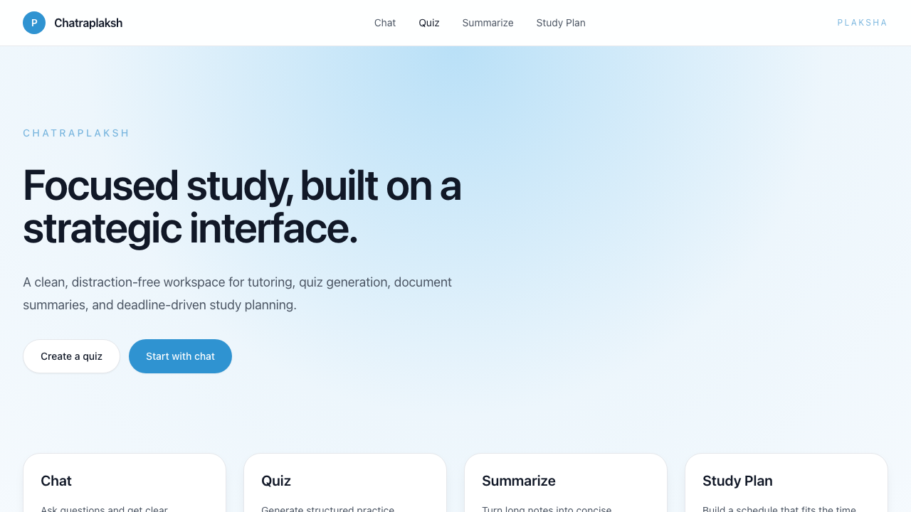
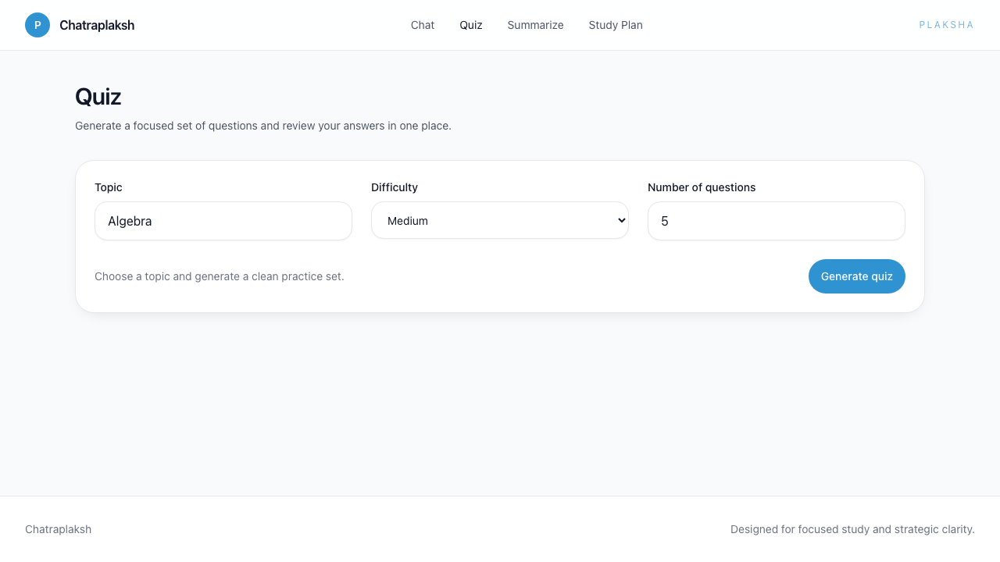
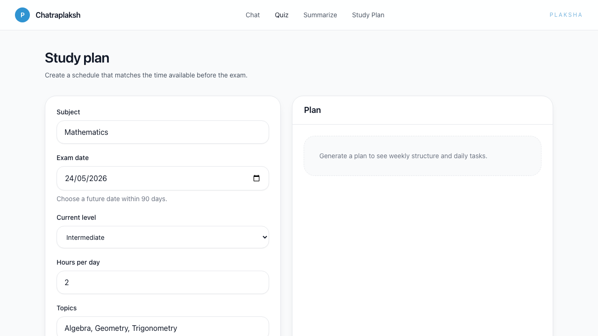

# Chatraplaksh

A simple study workspace for students who want help with four common tasks.

Live deployment: https://gr-meetup.vercel.app/

Core tasks:

- **Chat** with an AI tutor for explanations and study help
- **Generate quizzes** by topic and difficulty
- **Summarize notes or pasted text** into shorter study material
- **Build a study plan** based on exam date, level, and available time

The app has a minimal interface and keeps the workflow straightforward: pick a tool, enter your material, and review the result.

## Screenshots

### Home


### Quiz


### Study plan


## What the project does

From running the app locally, the main user flows are:

1. **Chat**  
   Ask study questions in plain language and get tutor-style responses.

2. **Quiz**  
   Enter a topic, choose a difficulty, choose the number of questions, and generate a quiz.

3. **Summarize**  
   Paste notes, article text, or lecture material and get a concise summary with key points.

4. **Study Plan**  
   Enter a subject, exam date, current level, study hours per day, and topics to generate a day-by-day plan.

## Requirements

- npm
- Node.js 18+
- A `GROQ_API_KEY` in your environment file for live AI-backed responses

## Local setup

1. Install dependencies:

```bash
npm install
```

2. Create an environment file:

```bash
cp .env.example .env
```

3. Add your Groq API key to `.env`:

```env
GROQ_API_KEY=your_key_here
```

## Run locally

Start the development server:

```bash
npm run dev
```

Then open:

```text
http://localhost:3000
```

## Available scripts

```bash
npm run dev        # start local dev server
npm run build      # production build
npm run start      # run production server
npm run lint       # lint the project
npm run type-check # TypeScript checks
npm run format     # format files
```

## How to use it

### Chat
- Open **Chat**
- Type a question or paste a passage
- Send the message and review the response

### Quiz
- Open **Quiz**
- Enter a topic
- Select difficulty and number of questions
- Generate the quiz and answer each question

### Summarize
- Open **Summarize**
- Paste notes or other text
- Choose summary type
- Generate the summary and review the key points

### Study Plan
- Open **Study Plan**
- Enter subject, exam date, level, hours per day, and topics
- Generate a plan
- Review the weekly and daily schedule

## Notes

- Best suited for quick study support and lightweight planning
- Current UI is clean and functional, with the core workflows already working locally
- Good fit for a prototype, demo, or student productivity starter app
